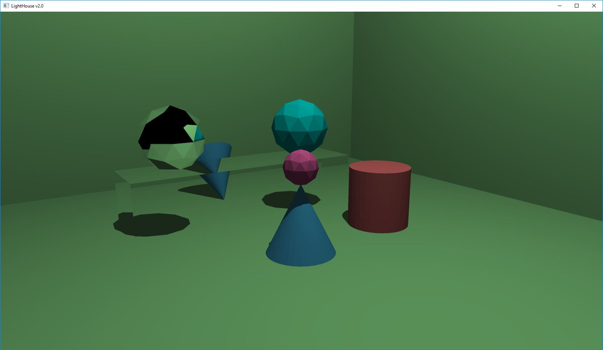
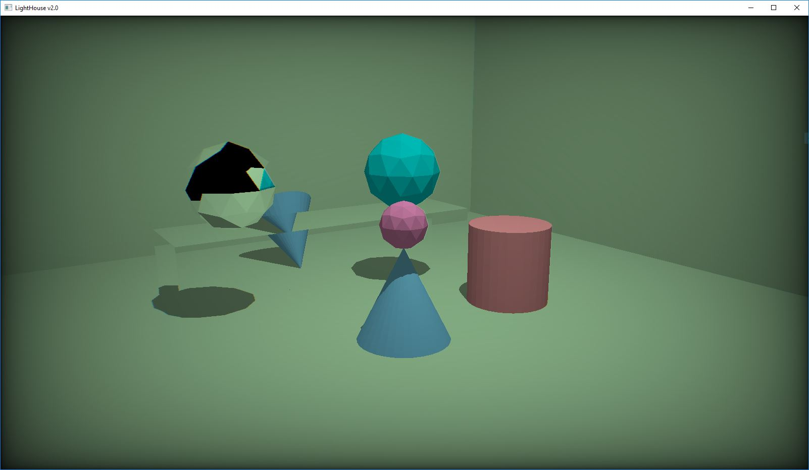
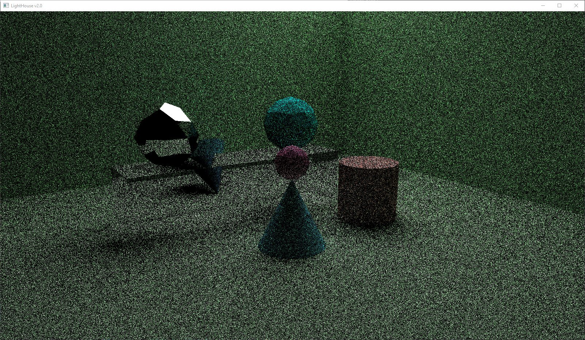
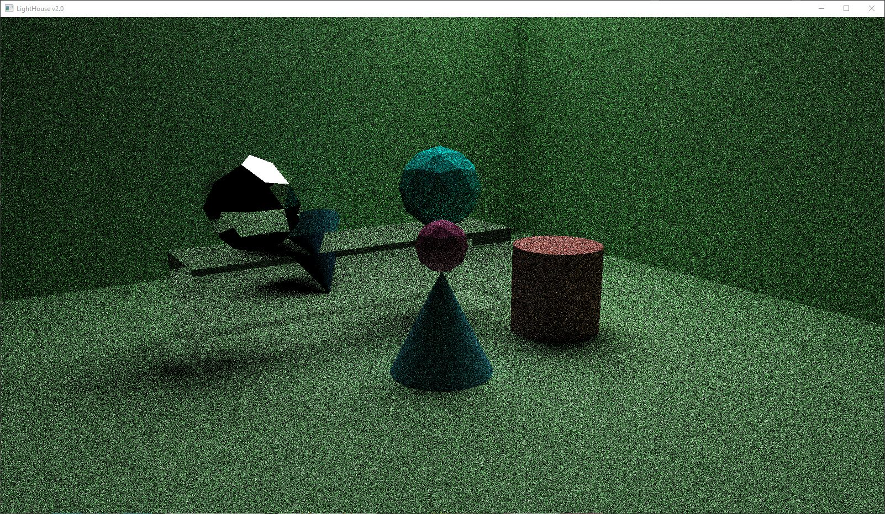
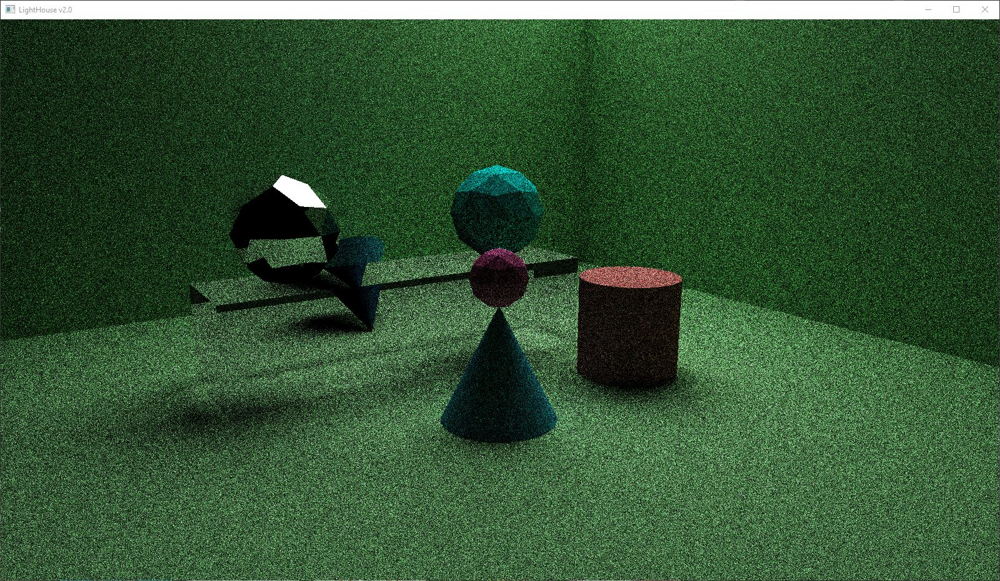

### Students:
Jort van Gorkum - 6142834
Vince van Noort - 6187021

All basics done.

### Additional points implemented:
- Anti-aliasing (In Whitted)
- Image postprocessing: gamma correction, vignetting and chromatic aberration (in Whitted)

### Whitted Renders:
No post processing

Anti aliasing (4x)

With post processing

### Kajiya Renders:
5 iterations

25 iterations

40 iterations

Sources: 
- https://www.scratchapixel.com/lessons/3d-basic-rendering/introduction-to-shading/reflection-refraction-fresnel
- https://www.scratchapixel.com/lessons/3d-basic-rendering/global-illumination-path-tracing/global-illumination-path-tracing-practical-implementation
- https://www.shadertoy.com/view/ltcyRf